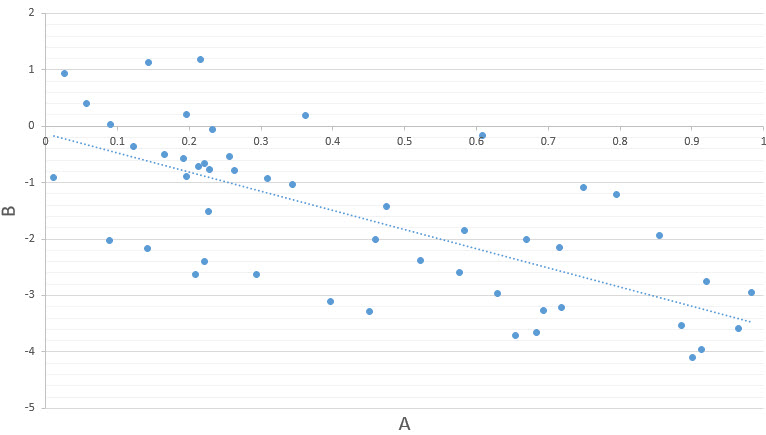

# R.4 - Mid-Term Exam

**Course:** DSRT-734-M51 - Inferential Statistics in Decision-Making
**Term:** 2025 Fall - Full Term
**Time Remaining:** 106 minutes (+ Unlimited extra time)
**Questions:** 9 of 10 questions remaining
**Total Points:** 200 points

---

## Instructions

For **multiple choice questions**, select the best answer.

For **essay questions**, please:
- Identify the correct test
- Write up the results according to the handbook
- Explain what the results mean to the researcher

---

## Question 1 (25 Points)

The attached dataset contains the distance a sample of people could throw a baseball and they could throw a football. Download the dataset, open it in JASP and determine if this dataset shows a correlation between the distance a person can throw a baseball and a football. Make sure to write your conclusion and APA statement.

**Dataset:** `baseball5.sav`

---

## Question 2 (20 Points)

The attached dataset contains the scores for two teams of 50 people. Use JASP and the attached dataset to calculate the mean, median, standard deviation, minimum and maximum of the scores for the two teams.

**Dataset:** `teams321.sav`

---

## Question 3 (10 Points)

**(True or False)** If you perform a test and get a p-value = 0.051 you should not reject the null hypothesis.

- [ ] True
- [ ] False

---

## Question 4 (20 Points)

A company wants to test if employees at branch A spend more time than employees at branch B working directly with customers. They collect a sample of 150 employees from branch A and 150 employees from branch B and measure how many hours a day they spend directly with customers. What kind of t-test should the researcher use?

- [ ] **Option A:** Two-sample t-test (independent samples)
- [ ] **Option B:** ANOVA
- [ ] **Option C:** One-sample t-test
- [ ] **Option D:** Paired samples t-test (dependent samples)

---

## Question 5 (30 Points)

A teacher wants to know if there is a difference between student's mid-term exam scores and final exam scores in a business course. The attached dataset has both scores for each student in her class of 50 students. Save the following dataset to your computer and open it in JASP. Perform the correct t-test to see if the scores for the student's first exam are different than their scores on the final. Copy and paste your JASP output into your answer AND write your conclusion in APA format.

**Dataset:** `examscores24.sav`

---

## Question 6 (20 Points)

Given the scatterplot below, choose the value for Pearson's Correlation below that most accurately approximates the correct correlation.

- [ ] **Option A:** r = 0.12
- [ ] **Option B:** r = 0.70
- [ ] **Option C:** r = -0.70
- [ ] **Option D:** r = -0.12

---

## Question 7 (25 Points)

Write the conclusion for the following t-test in APA format.

### Independent Samples T-Test

**Test Results:**

| Test | Statistic | df | p |
|------|-----------|-------|---------|
| Student | -3.654 | 63.000 | < .001 |
| Welch | -3.629 | 59.449 | < .001 |

### Assumption Checks - Test of Equality of Variances (Levene's)

| F | df | p |
|------|----|----|
| 1.211 | 1 | 0.275 |

### Descriptives

| Group | N | Mean | SD | SE |
|-------|-----|--------|--------|-------|
| A | 35 | 16.000 | 14.086 | 2.381 |
| B | 30 | 29.367 | 15.393 | 2.810 |

---

## Question 8 (30 Points)

A company make three different products (A, B, and C). They took a sample of 50 random products to see if the average weight of the products are equal.

**Tasks:**
1. Download the dataset and open it in JASP
2. Run the correct test to see if the average weights of the products are equal
3. Run any post hoc tests if necessary
4. Copy and paste your results into the answer
5. Write your conclusion statement in APA format

**Dataset:** `Product33.sav`

---

## Question 9 (20 Points)

Given the following results from an ANOVA test with a pairwise comparison post hoc test, which of the following statements is correct?

### ANOVA

| Cases | Sum of Squares | df | Mean Square | F | p |
|-------|----------------|-----|-------------|-------|-------|
| Group | 28.370 | 2 | 14.185 | 4.195 | 0.016 |
| Residuals | 1422.664 | 419 | 3.983 | | |

*Note: Type III Sum of Squares*

### Descriptives

| Group | Mean | SD | N |
|-------|------|------|-----|
| A | 2.002 | 1.875 | 170 |
| B | 2.338 | 2.293 | 139 |
| C | 1.517 | 2.387 | 113 |

### Post Hoc Tests - Standard Post Hoc Comparisons

| Comparison | | Mean Difference | SE | t | p tukey |
|------------|---|-----------------|-------|-------|---------|
| C | A | .336 | 0.237 | 1.492 | 0.290 |
| | B | 0.674 | 0.254 | 2.806 | 0.011 |
| A | B | -0.338 | 0.237 | -1.617 | 0.245 |

*Note: P-value adjusted for comparing a family of 3*

**Select the correct statement:**

- [ ] **Option A:** There are no significant differences between the groups.
- [ ] **Option B:** Group C is significantly different from Groups A and B, but Group A is not significantly different than Group B.
- [ ] **Option C:** Group A is significantly different from Groups B and C, and Group B is significantly different than Group C.
- [ ] **Option D:** Groups B and C are significantly different, but no other differences are significant.

---

## Question 10 (10 Points)

The length of time in hours a product takes to manufacture is estimated by the regression line Y = 4.5X + 5, where X is the number of components used in the manufacturing process. Estimate the length of time for a product with 8 components.

- [ ] **Option A:** 50 hours
- [ ] **Option B:** 13 hours
- [ ] **Option C:** 8 hours
- [ ] **Option D:** 41 hours

---

**End of Exam**
