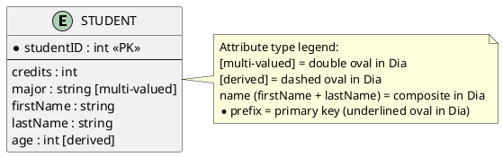
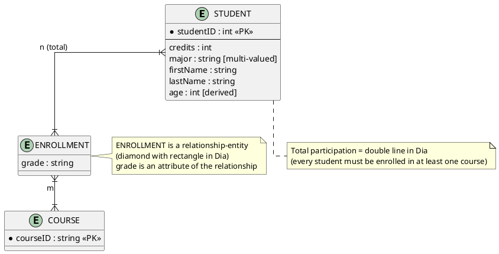
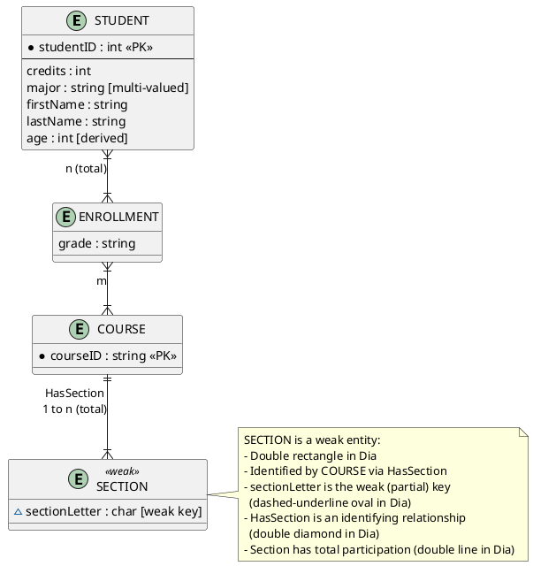
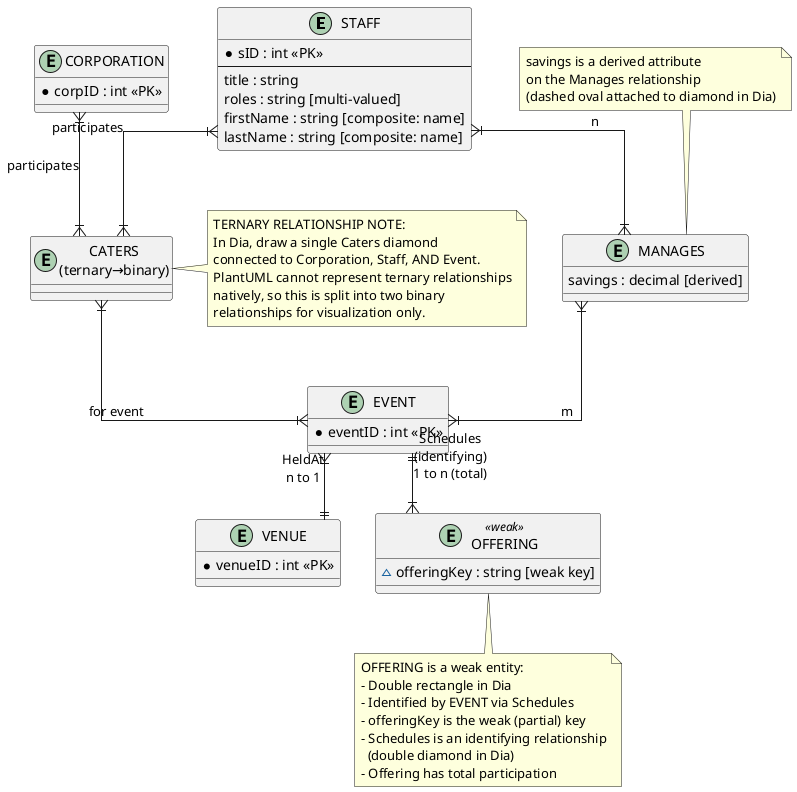
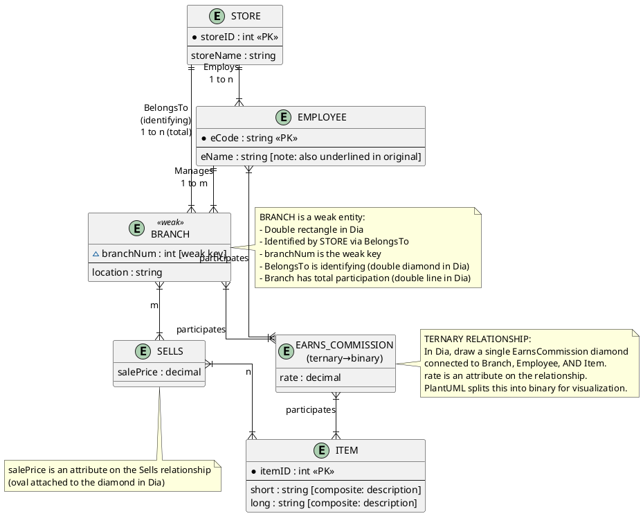

# ER Diagram Reference — Lab 1: Interpreting Entity-Relationship Diagrams Using Dia

**Course**: ITS-538 Database Systems (Spring 2026)
**Student**: Srinath Jagarlamudi
**Purpose**: PlantUML reference for planning and visualizing all Lab 1 ER diagrams locally before building them in Dia on the vWorkstation virtual machine. This file is a personal reference tool — not a Blackboard submission.

**How to use**: Open in VS Code with the PlantUML extension for live preview, or paste each block into https://www.plantuml.com/plantuml/uml/ to verify rendering.

**VS Code setup** — The PlantUML extension requires a server. Add this to your `settings.json` (`Cmd+Shift+P` → "Open User Settings JSON"):
```json
"plantuml.server": "https://www.plantuml.com/plantuml"
```

---

## Part 1: Student Entity

Single entity with varied attribute types (no relationships yet).

| Attribute | Type |
|-----------|------|
| `studentID` | Primary key |
| `credits` | Single-valued |
| `major` | Multi-valued |
| `name` → `firstName`, `lastName` | Composite |
| `age` | Derived |



---

## Part 2: Enrollment ERD (with Relationships)

Adds a `COURSE` entity and an `ENROLLMENT` relationship-entity. Student has **total participation** in ENROLLMENT (every student must be enrolled in at least one course).

| Element | Detail |
|---------|--------|
| `COURSE` | Strong entity, `courseID` PK |
| `ENROLLMENT` | Relationship with `grade` attribute |
| Cardinality | Student (n, total) ↔ ENROLLMENT ↔ (m) Course |
| Total participation | Double line on Student side in Dia |



---

## Part 3: Full ERD (with Weak Entity)

Builds on Part 2 by adding `SECTION` as a weak entity identified by `COURSE`.

| Element | Detail |
|---------|--------|
| `SECTION` | Weak entity, `sectionLetter` weak key |
| `HasSection` | Identifying relationship (double diamond in Dia) |
| Cardinality | Course (1) → HasSection → (n, total) Section |
| Total participation | Every section must belong to exactly one course |



---

## Challenge: Catering Application ERD

Full ERD for a catering company application, derived from the challenge question.

### Entities and Attributes

| Entity | Type | Key | Notable Attributes |
|--------|------|-----|--------------------|
| `STAFF` | Strong | `sID` | `title`, `roles` (multi-valued), `name` (composite) |
| `CORPORATION` | Strong | `corpID` | — |
| `EVENT` | Strong | `eventID` | — |
| `VENUE` | Strong | `venueID` | — |
| `OFFERING` | Weak | `offeringKey` (weak key) | — |

### Relationships

| Relationship | Type | Entities Involved | Attributes | Cardinality |
|-------------|------|-------------------|------------|-------------|
| `Manages` | Binary | Staff ↔ Event | `savings` (derived) | Many-to-many |
| `Schedules` | Identifying | Event ↔ Offering | — | 1:n, Offering total |
| `Caters` | Ternary | Corporation + Staff + Event | — | See note |
| `HeldAt` | Binary | Event ↔ Venue | — | Many-to-one |

> **PlantUML Limitation — Ternary Relationship**: PlantUML does not support true ternary relationships. The `Caters` relationship (Corporation + Staff + Event) is split into two binary relationships below for visualization. In Dia, draw a single diamond connected to all three entities.



---

## Challenge Part 1: Store ERD

Extracted from the lab PDF (`StoreConceptualDesign.jpg`). See original image: `store-erd.png`.

### Entities and Attributes

| Entity | Type | Key | Notable Attributes |
|--------|------|-----|--------------------|
| `STORE` | Strong | `storeID` (PK) | `storeName` |
| `BRANCH` | **Weak** | `branchNum` (weak key) | `location` |
| `EMPLOYEE` | Strong | `eCode` (PK) | `eName` (also underlined — possible design issue) |
| `ITEM` | Strong | `itemID` (PK) | `description` (composite: `short`, `long`) |

### Relationships

| Relationship | Type | Entities Involved | Attributes | Cardinality |
|-------------|------|-------------------|------------|-------------|
| `BelongsTo` | Identifying (double diamond) | Store ↔ Branch | — | Store(1) → Branch(n), Branch total participation |
| `Employs` | Binary | Store ↔ Employee | — | Store(1) → Employee(n) |
| `Manages` | Binary | Employee ↔ Branch | — | Employee(1) → Branch(m) |
| `Sells` | Binary | Branch ↔ Item | `salePrice` | Branch(m) ↔ Item(n) |
| `EarnsCommission` | **Ternary** | Branch + Employee + Item | `rate` | — |

> **Design Note**: `eName` on EMPLOYEE appears underlined in the diagram alongside `eCode`. An entity should have only one primary key. This may be a design error — `eCode` is likely the intended PK and `eName` may be incorrectly underlined.

> **Ternary Note**: `EarnsCommission` is a ternary relationship (Branch + Employee + Item). PlantUML splits it into binary relationships below. In Dia, draw a single diamond connected to all three entities.



---

## Notation Legend

| ER Concept | PlantUML Representation | Dia Representation |
|------------|------------------------|-------------------|
| Primary key | `*` prefix + `<<PK>>` tag | Underlined oval |
| Weak (partial) key | `~` prefix + `[weak key]` comment | Dashed-underline oval |
| Single-valued attribute | Plain attribute line | Single oval |
| Multi-valued attribute | `[multi-valued]` comment | Double oval |
| Derived attribute | `[derived]` comment | Dashed oval |
| Composite attribute | `[composite: name]` comment | Oval connected to sub-ovals |
| Strong entity | `entity` keyword | Single rectangle |
| Weak entity | `entity <<weak>>` stereotype | Double rectangle |
| Regular relationship | Single line between entities | Single diamond |
| Identifying relationship | Single line (annotated in note) | Double diamond |
| Total participation | `}\|` in cardinality notation | Double line on entity side |
| Partial participation | `\|` in cardinality notation | Single line on entity side |
| One (cardinality) | `\|` on the "one" side | `1` near entity |
| Many (cardinality) | `{` on the "many" side | `n` or `m` near entity |
| Attribute on relationship | Separate entity block (limitation) | Oval attached to diamond |
| Ternary relationship | Split into 2 binary (limitation) | Single diamond, 3 lines |

### PlantUML Cardinality Quick Reference

| Notation | Meaning |
|----------|---------|
| `\|\|--\|\|` | One-to-one (both mandatory) |
| `\|\|--|{` | One-to-many (left mandatory) |
| `}|--|{` | Many-to-many (both mandatory / total) |
| `\|o--o\|` | One-to-one (both optional) |
| `\|o--|{` | One-to-many (left optional) |

---

## Checklist: Parts to Build in Dia

Use this checklist when working on the vWorkstation virtual machine:

- [ ] **Part 1** — Student entity with all 5 attribute types (PK, single, multi-valued, composite, derived)
- [ ] **Part 2** — Add Course entity + Enrollment relationship-entity with `grade` attribute; set total participation on Student side
- [ ] **Part 3** — Add Section weak entity + HasSection identifying relationship; set total participation on Section side
- [ ] **Challenge Store ERD** — Analyze the Store ERD (see `store-erd.png` and PlantUML above); note the possible `eName` design issue
- [ ] **Challenge Catering ERD** — Build full catering ERD with all entities, weak entity, relationships, ternary Caters relationship
